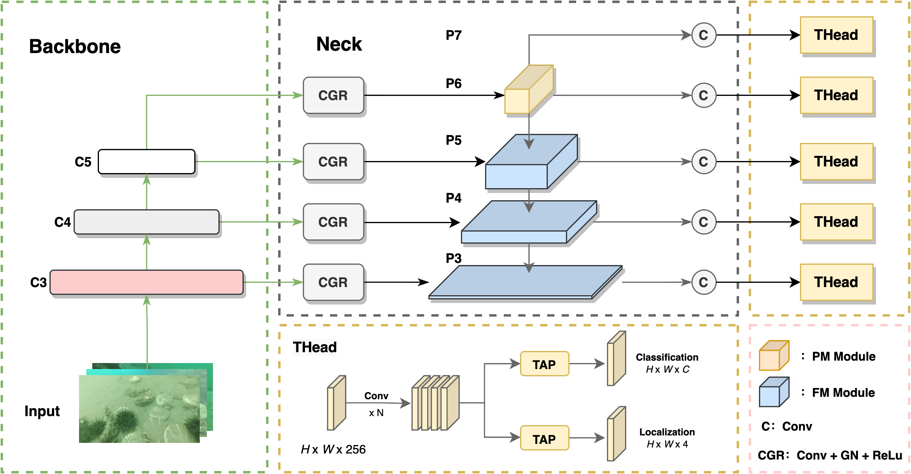
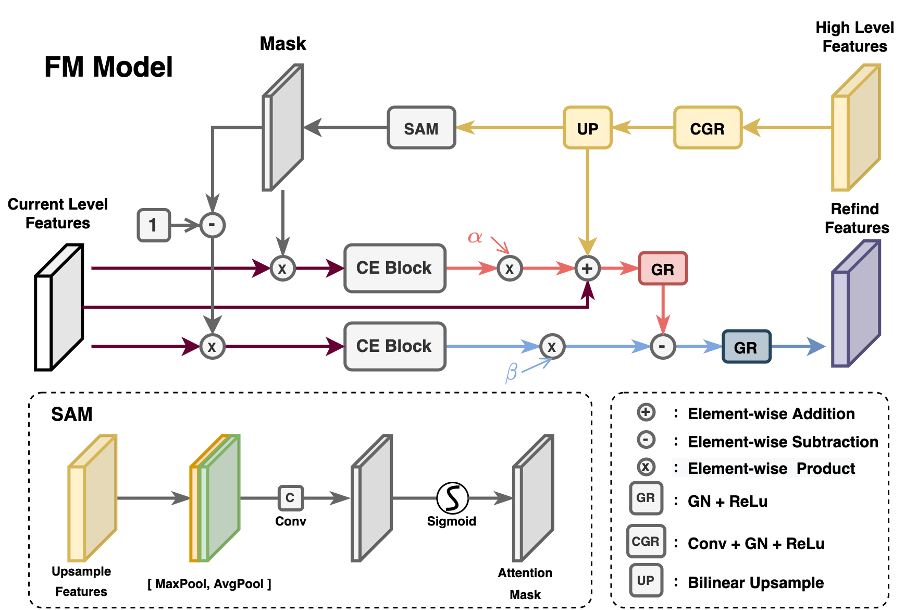
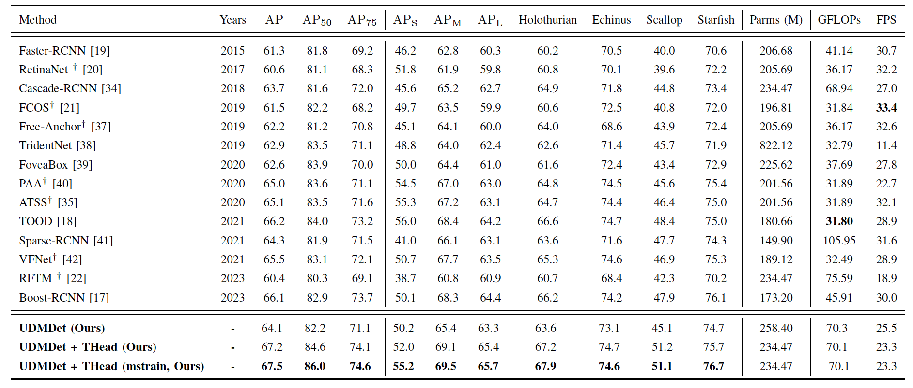

# A Novel Underwater Detection Method for Ambiguous Object Finding via Distraction Mining

This repository contains the code (in PyTorch) for the paper: ([IEEE TII](https://ieeexplore.ieee.org/document/10496913))

If you use this code, please cite our paper, and hit the star at the top-right corner. Thanks!
## Introduction

Underwater detection is a crucial task to lay the foundation for the intelligent marine industry. In contrast to land scenes, targets in degraded underwater environments show ambiguous and surrounding-similar profiles, causing it challenging for generic detectors to accurately extract features. Eliminating the interference of ambiguous features is one of the primary goals when recognizing underwater objects against complex backgrounds. To this aim, we propose a novel detection framework called underwater distraction mining detector (UDMDet). UDMDet is an end-to-end detector and has two key modules: distraction-aware FPN (DAFPN) and task-aligned head (THead). DAFPN is designed to progressively refine the coarse features via mining the discrepancies between objects and backgrounds, while THead enhances the information interaction between classification and localization to make predictions with higher quality. To overcome the feature ambiguous problem, the underwater distraction-aware model is proposed to extract the differences between objects and surroundings so as to clear the target boundary. Experimental results show that UDMDet can more effectively discover objects conceal on real-world underwater images and has a higher precision outperforming the state-of-the-art detectors. 





## Dependencies

- Python == 3.7.11
- PyTorch == 1.10.1
- mmdetection == 2.22.0
- mmcv == 1.4.0
- numpy == 1.21.2

## Installation

The basic installation follows with [mmdetection](https://github.com/mousecpn/mmdetection/blob/master/docs/get_started.md). It is recommended to use manual installation. 

## Datasets

**DUO**: https://github.com/chongweiliu/DUO

**UTDAC2020**: https://drive.google.com/file/d/1avyB-ht3VxNERHpAwNTuBRFOxiXDMczI/view?usp=sharing


Other underwater datasets: https://github.com/mousecpn/Collection-of-Underwater-Object-Detection-Dataset

After downloading all datasets, create udmdet document.

```
$ cd data
$ mkdir udmdet
```

It is recommended to symlink the dataset root to `$data`.

```
udmdet
├── data
│   ├── DUO
│   │   ├── annotaions
│   │   ├── train2017
│   │   ├── test2017
```


## Train

```
$ python tools/train.py configs/udmdet/udmdet_tood_r50_fpn_anchor_based_2x_duoc.py
```

## Test

```
$ python tools/test.py configs/udmdet/udmdet_tood_r50_fpn_anchor_based_2x_duo.py <path/to/checkpoints> --eval bbox
```

## Checkpoint

**DUO**: https://drive.google.com/file/d/1or3YfXaBEayxkNdrqdn1CetlOA06s3Av/view?usp=sharing


## Results




## Acknowledgement

Thanks MMDetection team for the wonderful open source project!

## Citation

```
@ARTICLE{Yuan_2024TII_UDMDet,
  author={Yuan, Jieyu and Cai, Zhanchuan and Cao, Wei},
  journal={IEEE Transactions on Industrial Informatics}, 
  title={A Novel Underwater Detection Method for Ambiguous Object Finding via Distraction Mining}, 
  year={2024},
  volume={},
  number={},
  pages={1-10},
  doi={10.1109/TII.2024.3383537}}
```

